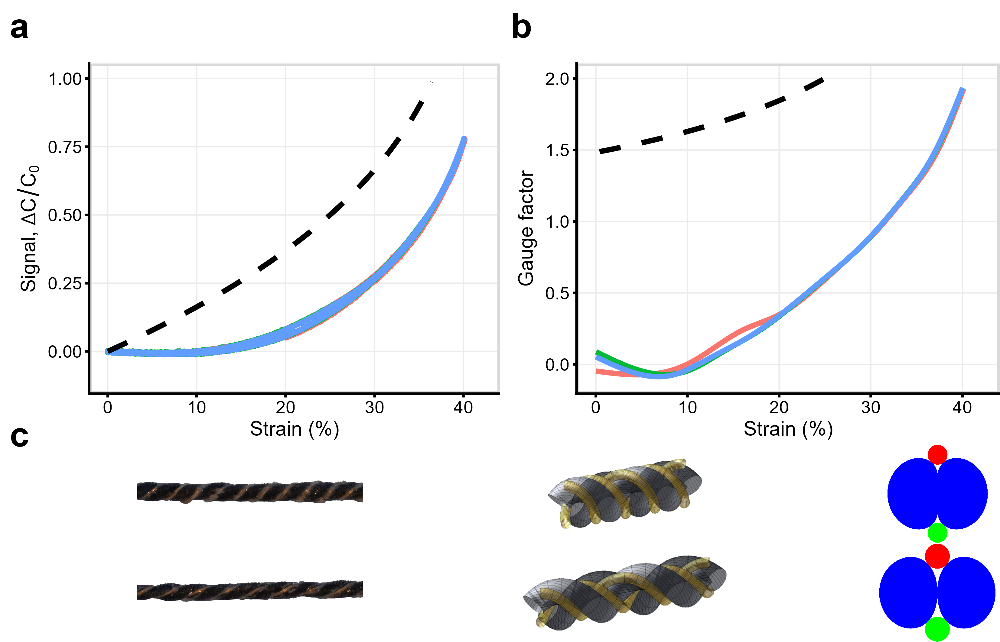
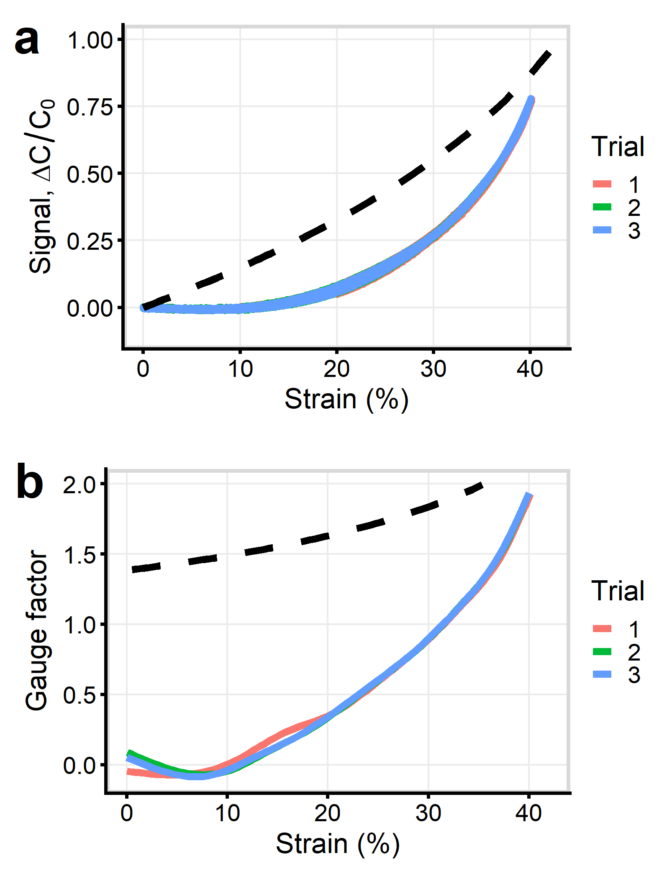
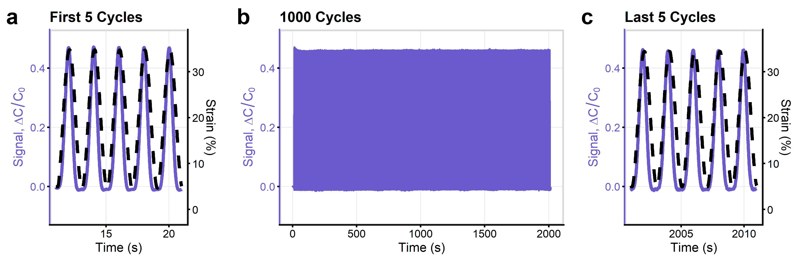

# 4-Ply Helical Auxetic Capacitive Sensors

This repository contains data and scripts necessary to reproduce the figures from the conference proceedings:

> [1] Brett C. Hannigan, Tyler J. Cuthbert, and Carlo Menon. "HACS4x: 4-Ply Helical Auxetic Capacitive Sensors for Strain Sensing E-textiles". _Engineering Proceedings_. 2023 (Accepted).

The repository is divided into two parts:

[Abstract](/Abstract.ipynb): Figure for initial, 1-page abstract submission.

[Extended Abstract](</Extended Abstract.ipynb>): Figures for final, 4-page extended abstract [1].

## Examples

  
   
  

## Requirements

R (version 4.3.1 used) with the following packages:
- `cowplot`
- `ggplot2`
- `magick`
- `patchwork`
- `pdftools`
- `readxl`
- `rsvg`

©2023 ETH Zurich, Brett Hannigan; D-HEST; Biomedical and Mobile Health Technology (BMHT) Lab; Carlo Menon